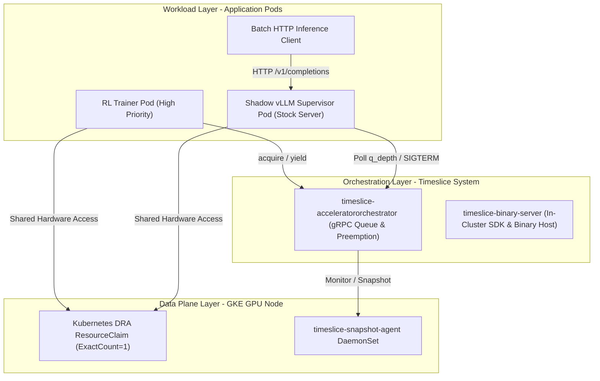
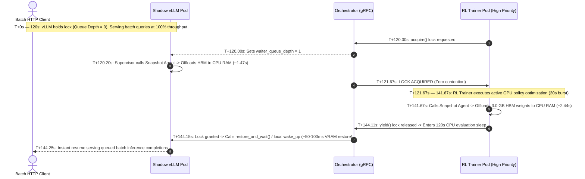

# Interleaving RL Trainers and vLLM Batch Inference

This guide walks you through how to implement **Cooperative Acceleration Time-Slicing (CATS)** to share a single GPU or TPU pool between a high-priority **Reinforcement Learning (RL) Trainer** and an unmodified, **vLLM Inference Engine**.

By converting the natural idle valleys in RL training loops into high-throughput offline inference, this architecture elevates effective accelerator duty cycles (from **~14% in our demo setup to over 98%**) while guaranteeing zero priority inversion for your training jobs—without requiring custom C++/CUDA kernels or modifying either application's source code.

---

## 1. Concepts & Architecture

### The RL Trainer Duty Cycle Bottleneck
In production reinforcement learning pipelines, workloads alternate between two distinct phases:
1. **Active GPU Training:** Executing intensive forward/backward passes and policy optimization on the GPU.
2. **Idle Valleys:** Resulting from distributed rollout generation, reward evaluation, and network synchronization.

The actual GPU duty cycle utilization of an RL trainer depends heavily on the specific architecture, environment complexity, and synchronization details of the RL run. In production environments, we often observe the active Trainer utilizing the GPU between **20% to 50%** of the time, with the remaining time spent in idle evaluation and rollout valleys where expensive hardware (such as NVIDIA L4 or H100 GPUs) sits completely idle.

> [!NOTE]
> **Realistic HBM Footprints & Demo Timings:** In this POC, we demonstrate how these idle duty cycles can be efficiently harvested for serving latency-tolerant inference. To benchmark realistic memory swapping without exceeding node cgroup memory limits on standard 16 GB GKE VMs, our demo script (`rl_trainer.py`) allocates a persistent **3.0 GB neural network policy model and AdamW optimizer state** in GPU HBM. It executes active gradient backpropagation (`BUSY_SECONDS=20`) and uses the Snapshot Agent (`app_endpoint` backend) to offload real HBM memory during CPU rollout/evaluation valleys (`IDLE_SECONDS=120`). 
>
> The resulting **14.3%** (`20s / 140s`) baseline GPU duty cycle is a result of the specific compressed timings we picked to demonstrate cooperative preemption and time-slicing in real time within a 3-minute demo window, and is not an inherent property of RL training in general.

### The Cooperative Interleaving Opportunity
Offline batch inference (such as vLLM processing background completions or synthetic data generation) is an ideal partner workload for RL training. Because batch inference is latency-tolerant, it can dynamically harvest 100% of the GPU capacity during the RL Trainer's idle valleys. 

When the high-priority RL Trainer needs the GPU, it signals the batch inference engine to yield hardware memory in milliseconds. This boosts overall cluster duty cycles to **over 98%** while guaranteeing that RL training jobs never wait in queues.

### The Supervisor Pattern & Application-Aware Swapping
A primary requirement for enterprise production is **zero modification to third-party inference engines** and robust compatibility with Kubernetes Dynamic Resource Allocation (DRA). Rather than terminating and restarting vLLM every cycle (which incurs lengthy 30–60+ second cold starts) or relying on process-level CUDA checkpointing (which hits operating system / driver limitations when checkpointing across CDI / DRA container boundaries), we deploy supervisor logic that leverages native **Application-Aware Offloading** (`app_endpoint` backend) for both workloads:

1. **Shadow vLLM (`orchestrated_vllm_runner.py`)**: Uses vLLM's native **Sleep Mode** (`--enable-sleep-mode`) over port 8000. When preempted, it offloads 15.37 GiB of GPU KV cache and weights to host RAM in **~1.47s**.
2. **RL Trainer (`rl_trainer.py`)**: Embeds a lightweight HTTP offload handler on port 8001 (`/sleep` and `/wake_up`). When preempted, it moves 3.0 GB of real neural network policy weights and AdamW optimizer states across PCIe Gen4 to CPU RAM in **~2.44s**.

```python
with SnapshotAgentClient(AGENT_ENDPOINT) as snap_client:
    while True:
        with client.on_accelerators() as lock:
            if proc is None:
                # 1. Launch stock vLLM on first start with Sleep Mode enabled
                proc = subprocess.Popen([... "--enable-sleep-mode" ...])
            else:
                # 2. Wake up vLLM: Restore weights from CPU RAM to GPU HBM (~50-100ms!)
                try:
                    snap_client.restore_and_wait(job_id=JOB_ID, backend_config=vllm_config)
                except Exception as e:
                    # Resilient fallback: guarantee local wake_up if agent returns already-running
                    try: urllib.request.urlopen("http://127.0.0.1:8000/wake_up", data=b"")
                    except Exception: pass

            # 3. Poll Orchestrator queue depth; offload HBM if higher-priority job arrives
            while proc.poll() is None:
                time.sleep(0.5)
                status = client.get_status(group_id="trainer-group")
                if status.group and status.group.waiter_queue_depth > 0:
                    # 4. Offload HBM weights to CPU RAM (~1.47s) without killing the process
                    snap_client.snapshot_and_wait(job_id=JOB_ID, backend_config=vllm_config)
                    break
```

* **When RL is Idle (`waiter_queue_depth == 0`):** The supervisor holds the lock and stock vLLM serves HTTP batch inference traffic continuously.
* **When RL Wakes Up (`waiter_queue_depth > 0`):** The instant the RL Trainer calls `acquire()`, the supervisor calls the Snapshot Agent to offload GPU framebuffer memory to CPU system RAM in ~1.47s and yields the lock—without terminating the server process. When the lock is re-acquired, `restore_and_wait()` (with direct `/wake_up` fallback) copies model weights back into GPU HBM, resuming inference in **~50–100ms**.

### Architecture & Operational Layers



---

## 2. Cluster Setup & Prerequisites

To enable cooperative time-slicing between trainers and inference engines, your Kubernetes cluster must be configured with:
* **Kubernetes Version:** `v1.32+` with Dynamic Resource Allocation (DRA) enabled.
* **NVIDIA Drivers:** Driver `565+` with the `gpu.nvidia.com` device class installed.
* **Node Pool Labeling:** Label GPU nodes with their resource group (e.g., `group.timeslice.io/trainer-group="true"`).
* **Node Pool Tainting:** Taint GPU nodes with `timeslice.io/shared="true":NoSchedule` to prevent unmanaged workloads from scheduling onto time-sliced hardware.

### Deploying the Timeslice Platform
Deploy the core platform components (Orchestrator gRPC service, Snapshot Agent DaemonSet, and DRA driver) into the `timeslice-system` namespace using Helm:

```bash
helm upgrade --install timeslice ./deploy \
  -f ./deploy/values-gke.yaml \
  --namespace timeslice-system \
  --create-namespace
```

Verify that all system components are ready:
```bash
kubectl get pods -n timeslice-system
```

---

## 3. Step-by-Step Walkthrough: Deploying Interleaved Workloads

We will deploy four components into a target namespace (e.g., `rl-batch-demo`):
1. A **Shared DRA ResourceClaim** requesting exactly one GPU.
2. The **High-Priority RL Trainer Pod**.
3. The **Cooperative Shadow vLLM Pod**.
4. The **HTTP Batch Load Generator Pod**.

### Step 1: Define the Shared DRA ResourceClaim
To share physical hardware cooperatively, workloads request devices via Kubernetes Dynamic Resource Allocation (`ResourceClaim`) rather than traditional `resources.limits`. Define a single `ResourceClaim` with `allocationMode: ExactCount`:

```yaml
# 01-trainer-gpu-claim.yaml
apiVersion: resource.k8s.io/v1
kind: ResourceClaim
metadata:
  name: trainer-gpu-claim
  namespace: rl-batch-demo
spec:
  devices:
    requests:
    - name: single-gpu
      exactly:
        deviceClassName: gpu.nvidia.com
        allocationMode: ExactCount
        count: 1
```

By referencing this exact same `trainer-gpu-claim` in multiple pod manifests, Kubernetes DRA mounts the full, unpartitioned device into both containers. Unlike static partitioning (such as NVIDIA MIG), this permits both pods to bind to the same physical GPU node and consume **100% of the GPU's physical resources** (compute cores, HBM memory capacity, and bandwidth) during their active execution windows, while the Orchestrator enforces temporal mutual exclusion.

### Step 2: Configure the Priority RL Trainer Pod
Configure the RL Trainer pod manifest with the required time-slicing labels, node selectors, tolerations, and resource claim references:

```yaml
# 03-rl-trainer-pod.yaml
apiVersion: v1
kind: Pod
metadata:
  name: rl-trainer
  namespace: rl-batch-demo
  labels:
    timeslice.io/job-id: "rl-trainer"
    timeslice.io/group: "trainer-group" # Contends for the trainer-group lock
spec:
  containers:
  - name: trainer
    image: pytorch/pytorch:2.5.1-cuda12.4-cudnn9-runtime
    command: ["python3", "/scripts/rl_trainer.py"]
    env:
    - name: BUSY_SECONDS
      value: "20"  # Active GPU training burst
    - name: IDLE_SECONDS
      value: "120" # CPU rollout/evaluation sleep valley
    - name: MODEL_VRAM_GB
      value: "3.0" # Realistic multi-gigabyte HBM policy weight footprint
    - name: NODE_IP
      valueFrom:
        fieldRef:
          fieldPath: status.hostIP
    - name: AGENT_ENDPOINT
      value: "$(NODE_IP):9001"
    resources:
      claims:
      - name: accelerator
  resourceClaims:
  - name: accelerator
    resourceClaimName: trainer-gpu-claim # References the shared DRA claim
  nodeSelector:
    group.timeslice.io/trainer-group: "true"
  tolerations:
  - key: "nvidia.com/gpu"
    operator: "Equal"
    value: "present"
    effect: "NoSchedule"
  - key: "timeslice.io/shared"
    operator: "Equal"
    value: "true"
    effect: "NoSchedule"
```

In our training loop (`rl_trainer.py`), we model an RL trainer by allocating persistent neural network weights in HBM and using the Snapshot Agent (`app_endpoint` backend on port 8001) to swap memory inside the `on_accelerators()` context manager:
```python
with SnapshotAgentClient(AGENT_ENDPOINT) as snap_client:
    for iteration in range(1, 100):
        # 1. Acquire GPU lock (preempts Shadow vLLM instantly)
        with client.on_accelerators(group_id="trainer-group") as lock:
            if model is None:
                model, optimizer = create_model_and_optimizer(device) # Allocates 3GB in HBM
            else:
                # Restore 3GB model weights from CPU host RAM into GPU HBM
                snap_client.restore_and_wait(job_id="rl-trainer", backend_config=app_config)
                
            execute_gpu_policy_training(model, optimizer, duration_sec=20)
            
            # Offload 3GB model weights to CPU host RAM before yielding lock
            snap_client.snapshot_and_wait(job_id="rl-trainer", backend_config=app_config)
            
        # 2. Lock is yielded automatically upon exiting context.
        # Shadow vLLM auto-resumes during this CPU evaluation valley:
        execute_cpu_rollouts_and_eval(duration_sec=120)
```

### Step 3: Configure the Cooperative Shadow vLLM Pod
Configure the Shadow vLLM pod manifest to belong to the same resource group (`trainer-group`) and reference the same DRA `ResourceClaim`:

```yaml
# 04-shadow-vllm-pod.yaml
apiVersion: v1
kind: Pod
metadata:
  name: shadow-vllm
  namespace: rl-batch-demo
  labels:
    timeslice.io/job-id: "batch-inference"
    timeslice.io/group: "trainer-group" # Shared lock queue with RL Trainer
spec:
  containers:
  - name: vllm
    image: vllm/vllm-openai:latest
    command: ["python3", "/scripts/orchestrated_vllm_runner.py"]
    env:
    - name: MODEL_NAME
      value: "Qwen/Qwen2.5-0.5B-Instruct"
    - name: PORT
      value: "8000"
    - name: NODE_IP
      valueFrom:
        fieldRef:
          fieldPath: status.hostIP
    - name: AGENT_ENDPOINT
      value: "$(NODE_IP):9001"
    ports:
    - containerPort: 8000
    resources:
      claims:
      - name: accelerator
  resourceClaims:
  - name: accelerator
    resourceClaimName: trainer-gpu-claim # References the exact same shared DRA claim
  nodeSelector:
    group.timeslice.io/trainer-group: "true"
  tolerations:
  - key: "nvidia.com/gpu"
    operator: "Equal"
    value: "present"
    effect: "NoSchedule"
  - key: "timeslice.io/shared"
    operator: "Equal"
    value: "true"
    effect: "NoSchedule"
---
apiVersion: v1
kind: Service
metadata:
  name: shadow-vllm-service
  namespace: rl-batch-demo
spec:
  selector:
    timeslice.io/job-id: "batch-inference"
  ports:
  - port: 8000
    targetPort: 8000
```

### Step 4: Deploy and Apply Manifests
Apply all manifests to start the interleaved workloads:

```bash
kubectl apply -f 01-trainer-gpu-claim.yaml
kubectl apply -f 03-rl-trainer-pod.yaml
kubectl apply -f 04-shadow-vllm-pod.yaml
```

---

## 4. Verifying Interleaved Progress & Preemption Guarantees

### A. Synchronized Second-by-Second Timeline
Run the following command to observe the live, synchronized 1-to-1 timeline across the RL Trainer, Shadow vLLM, and Batch Inference Client:

```bash
python3 -c '
import subprocess
t_out = subprocess.check_output(["kubectl", "logs", "-n", "rl-batch-demo", "rl-trainer", "--since=300s", "--timestamps"]).decode("utf-8", errors="replace").splitlines()
v_out = subprocess.check_output(["kubectl", "logs", "-n", "rl-batch-demo", "shadow-vllm", "--since=300s", "--timestamps"]).decode("utf-8", errors="replace").splitlines()
b_out = subprocess.check_output(["kubectl", "logs", "-n", "rl-batch-demo", "batch-load-generator", "--since=300s", "--timestamps"]).decode("utf-8", errors="replace").splitlines()

events = []
for l in t_out:
    if any(k in l for k in ["LOCK", "Requesting", "Training phase"]):
        events.append((l.split(" ", 1)[0], f"\033[1;33m[RL-TRAINER]   {l.split(\" \", 1)[1]}\033[0m"))
for l in v_out:
    if any(k in l for k in ["LOCK", "Preemption signal", "Launching stock vLLM"]):
        events.append((l.split(" ", 1)[0], f"\033[1;36m[SHADOW-VLLM]  {l.split(\" \", 1)[1]}\033[0m"))
for l in b_out:
    if "COMPLETED INFERENCE QUERY" in l:
        events.append((l.split(" ", 1)[0], f"\033[1;32m[BATCH-CLIENT] {l.split(\" \", 1)[1]}\033[0m"))

events.sort(key=lambda x: x[0])
for ts, msg in events[-25:]: print(f"{ts[:23]} | {msg}")
'
```

### B. The Dynamic Preemption Handshake Sequence
The output demonstrates the exact empirical preemption sequence guaranteed by the Orchestrator and measured on our GKE cluster:



### C. Duty Cycle Efficiency Summary
Across a rolling cooperative training cycle (140s base period + ~3.91s swapping overhead = ~143.91s total cycle period), empirical node efficiency is transformed:

| Workload / State | Empirical Duration | GPU Duty Share (%) |
| :--- | :---: | :---: |
| **RL Trainer** *(Active GPU Gradient Backpropagation)* | `20.00s` | **13.9%** |
| **Shadow vLLM** *(Harvested Batch Inference Serving)* | `120.00s` | **83.4%** |
| **Total PCIe Swapping Overhead** *(~1.47s vLLM offload + ~2.44s trainer offload)* | `3.91s` | **2.7%** |
| **TOTAL EFFECTIVE GPU UTILIZATION** | **140.00s / 143.91s** | **97.3% DUTY CYCLE** |

---

## 5. Best Practices & Production Tuning

1. **Application-Aware Swapping over CDI / DRA:**  
   When running under Kubernetes Dynamic Resource Allocation (DRA) with Container Device Interface (CDI) namespacing, driver-level tools like `cuda-checkpoint` may hit operating system limitations across container boundaries. Always prefer **Application-Aware Offloading** (`app_endpoint` backend), such as vLLM Sleep Mode (`--enable-sleep-mode`) or embedded HTTP offload handlers in training scripts. This moves weights natively over PCIe Gen4 in ~1.5–2.5s without relying on external ptrace/CDI ioctls.
2. **cgroup Memory Limits & Host RAM Sizing:**  
   When swapping multi-gigabyte models from GPU HBM to host CPU memory, node pod cgroup memory limits (`/kubepods.slice`) must be sized to accommodate the combined CPU memory footprint of the sleeping inference engine (~3.3 GB for vLLM), system daemons (~4.7 GB), and the swapped-out trainer weights. On standard 16 GB GKE VMs (where pod cgroup memory is capped at ~13.6 GB), keep trainer model footprints at or below 3.0 GB to avoid triggering Linux kernel OOM kills.
3. **Local Disk Model Caching (`hostPath`):**  
   Mount a local host disk volume (e.g., `hostPath: /tmp/huggingface_cache` -> `/root/.cache`) in inference pods. This caches Hugging Face model checkpoints locally on the node, eliminating 30–40s network download delays and allowing instant pod restarts.
4. **Resilient Wake-Up Fallbacks:**  
   When a pod re-acquires the Orchestrator lock, the Snapshot Agent DaemonSet may already report the job as `RUNNING` due to residual CUDA context detection in NVML, causing gRPC `restore_and_wait()` to return `already-running`. Add explicit local HTTP `/wake_up` fallback calls upon lock acquisition in supervisor scripts to guarantee rapid ~50–100 ms GPU resumption.
5. **GPU Memory Utilization Headroom:**  
   Set `--gpu-memory-utilization 0.7` (or `0.75`). Leaving 25–30% framebuffer headroom ensures that OS buffers and memory swap operations complete instantaneously during preemption without triggering out-of-memory (OOM) kernel panics.
6. **Supervisor Polling Interval:**  
   In `orchestrated_vllm_runner.py`, poll `client.get_status()` every `1.0` or `0.5` seconds. A 500ms polling interval ensures that preemption signals are detected and acted upon almost instantly, keeping RL Trainer wait times under 500ms.
7. **Observability & Alerting:**  
   Monitor `dcgm_gpu_utilization` via NVIDIA DCGM Exporter alongside `timeslice_orchestrator_lock_state` in Grafana. Set alerts if `timeslice_vllm_supervisor_yield_latency_seconds > 1.0s` to identify abnormal memory offload hangs.
