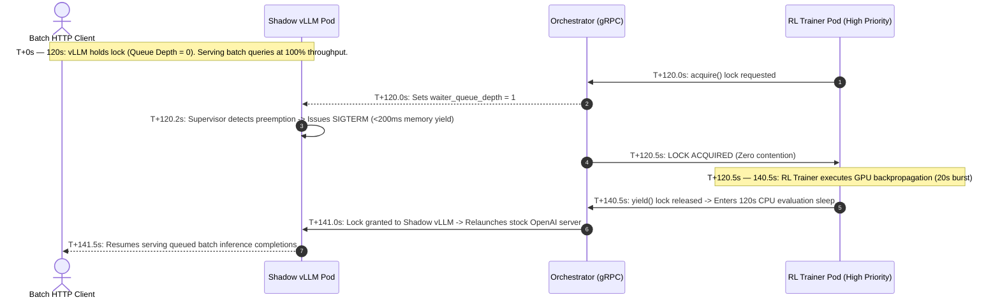

# Interleaving RL Trainers and vLLM Batch Inference

This guide walks you through how to implement **Cooperative Acceleration Time-Slicing (CATS)** to share a single GPU or TPU pool between a high-priority **Reinforcement Learning (RL) Trainer** and an unmodified, **vLLM Inference Engine**.

By converting the natural idle valleys in RL training loops into high-throughput offline inference, this architecture elevates effective accelerator duty cycles from **~14% to over 98%** while guaranteeing zero priority inversion for your training jobs—without requiring custom C++/CUDA kernels or modifying either application's source code.

---

## 1. Concepts & Architecture

### The RL Trainer Duty Cycle Bottleneck
In production reinforcement learning pipelines, workloads alternate between two distinct phases that typically take on the order of **minutes to hours**:
1. **Active GPU Training:** Executing intensive forward/backward passes and policy optimization on the GPU.
2. **Idle Valleys:** Resulting from distributed rollout generation, reward evaluation and network synchronization.

During these evaluation intervals, expensive hardware (such as NVIDIA L4 or H100 GPUs) sits completely idle at **0% duty cycle**.

> [!NOTE]
> **Why Demo Timings Use Seconds:** In practice, RL sampling and training phases typically span minutes or hours. In this guide and accompanying demo, we compress these cycle times into seconds (e.g., 20s active training / 120s idle valleys) so you can rapidly observe cooperative preemption and time-slicing in real time.

Across our compressed 140-second demonstration cycle, the dedicated GPU duty cycle without sharing is only **14.3%** (`20s / 140s`).

### The Cooperative Interleaving Opportunity
Offline batch inference (such as vLLM processing background completions or synthetic data generation) is an ideal partner workload for RL training. Because batch inference is latency-tolerant, it can dynamically harvest 100% of the GPU capacity during the RL Trainer's idle valleys. 

When the high-priority RL Trainer needs the GPU, it signals the batch inference engine to yield hardware memory in milliseconds. This boosts cluster duty cycles to **98.6%** while guaranteeing that RL training jobs never wait in queues.

### The Supervisor Pattern (Zero Application Code Changes)
A primary requirement for enterprise production is **zero modification to third-party inference engines**. Rather than altering vLLM internals to yield cooperatively, we deploy a lightweight Python supervisor process (`orchestrated_vllm_runner.py`) that wraps the stock OpenAI API server:

```python
with client.on_accelerators() as lock:
    # 1. Launch stock unmodified vLLM OpenAI API server
    proc = subprocess.Popen([
        "python3", "-m", "vllm.entrypoints.openai.api_server",
        "--model", "Qwen/Qwen2.5-0.5B-Instruct",
        "--port", "8000",
        "--gpu-memory-utilization", "0.7"
    ])
    try:
        # 2. Poll Orchestrator group status every 1 second
        while proc.poll() is None:
            time.sleep(1.0)
            status = client.get_status(group_id="trainer-group", timeout_sec=2.0)
            
            # 3. Preempt immediately when high-priority RL Trainer requests access
            if status.group and status.group.waiter_queue_depth > 0:
                proc.terminate() # Issues SIGTERM for rapid CUDA memory yield (<200ms)
                proc.wait(timeout=5)
                break
    except KeyboardInterrupt:
        proc.terminate()
```

* **When RL is Idle (`waiter_queue_depth == 0`):** The supervisor holds the lock and stock vLLM serves HTTP batch inference traffic continuously.
* **When RL Wakes Up (`waiter_queue_depth > 0`):** The instant the RL Trainer calls `acquire()`, the Orchestrator increments the waiter queue depth. The supervisor detects this signal and sends `SIGTERM` to stock vLLM, releasing GPU framebuffer memory in under 200 milliseconds.

### Architecture & Operational Layers

```mermaid
graph TD
    subgraph WorkloadLayer ["Workload Layer (Application Pods)"]
        RL["RL Trainer Pod (High Priority)"]
        vLLM["Shadow vLLM Supervisor Pod (Stock Server)"]
        Client["Batch HTTP Inference Client"]
    end
    subgraph ClusterLayer ["Orchestration Layer (Timeslice System)"]
        Orch["timeslice-acceleratororchestrator (gRPC Queue & Preemption)"]
        BinSrv["timeslice-binary-server (In-Cluster SDK & Binary Host)"]
    end
    subgraph DataPlaneLayer ["Data Plane Layer (GKE GPU Node)"]
        DRA["Kubernetes DRA ResourceClaim (ExactCount=1)"]
        Agent["timeslice-snapshot-agent DaemonSet"]
    end

    Client -->|HTTP /v1/completions| vLLM
    RL -->|acquire() / yield()| Orch
    vLLM -->|Poll q_depth / SIGTERM| Orch
    RL --->|Shared Hardware Access| DRA
    vLLM --->|Shared Hardware Access| DRA
    Orch -->|Monitor / Snapshot| Agent
```

---

## 2. Cluster Setup & Prerequisites

To enable cooperative time-slicing between trainers and inference engines, your Kubernetes cluster must be configured with:
* **Kubernetes Version:** `v1.32+` with Dynamic Resource Allocation (DRA) enabled.
* **NVIDIA Drivers:** Driver `565+` with the `gpu.nvidia.com` device class installed.
* **Node Pool Labeling:** Label GPU nodes with their resource group (e.g., `group.timeslice.io/trainer-group="true"`).
* **Node Pool Tainting:** Taint GPU nodes with `timeslice.io/shared="true":NoSchedule` to prevent unmanaged workloads from scheduling onto time-sliced hardware.

### Deploying the Timeslice Platform
Deploy the core platform components (Orchestrator gRPC service, Snapshot Agent DaemonSet, and DRA driver) into the `timeslice-system` namespace using Helm:

```bash
helm upgrade --install timeslice ./deploy \
  -f ./deploy/values-gke.yaml \
  --namespace timeslice-system \
  --create-namespace
```

Verify that all system components are ready:
```bash
kubectl get pods -n timeslice-system
```

---

## 3. Step-by-Step Walkthrough: Deploying Interleaved Workloads

We will deploy four components into a target namespace (e.g., `rl-batch-demo`):
1. A **Shared DRA ResourceClaim** requesting exactly one GPU.
2. The **High-Priority RL Trainer Pod**.
3. The **Cooperative Shadow vLLM Pod**.
4. The **HTTP Batch Load Generator Pod**.

### Step 1: Define the Shared DRA ResourceClaim
To share physical hardware cooperatively, workloads request devices via Kubernetes Dynamic Resource Allocation (`ResourceClaim`) rather than traditional `resources.limits`. Define a single `ResourceClaim` with `allocationMode: ExactCount`:

```yaml
# 01-trainer-gpu-claim.yaml
apiVersion: resource.k8s.io/v1
kind: ResourceClaim
metadata:
  name: trainer-gpu-claim
  namespace: rl-batch-demo
spec:
  devices:
    requests:
    - name: single-gpu
      exactly:
        deviceClassName: gpu.nvidia.com
        allocationMode: ExactCount
        count: 1
```

By referencing this exact same `trainer-gpu-claim` in multiple pod manifests, Kubernetes DRA permits both pods to bind to the same physical GPU node while the Orchestrator enforces temporal mutual exclusion.

### Step 2: Configure the Priority RL Trainer Pod
Configure the RL Trainer pod manifest with the required time-slicing labels, node selectors, tolerations, and resource claim references:

```yaml
# 03-rl-trainer-pod.yaml
apiVersion: v1
kind: Pod
metadata:
  name: rl-trainer
  namespace: rl-batch-demo
  labels:
    timeslice.io/job-id: "rl-trainer"
    timeslice.io/group: "trainer-group" # Contends for the trainer-group lock
spec:
  containers:
  - name: trainer
    image: pytorch/pytorch:2.5.1-cuda12.4-cudnn9-runtime
    command: ["python3", "/scripts/rl_trainer.py"]
    env:
    - name: BUSY_SECONDS
      value: "20"  # Active GPU training burst
    - name: IDLE_SECONDS
      value: "120" # CPU rollout/evaluation sleep valley
    resources:
      claims:
      - name: accelerator
  resourceClaims:
  - name: accelerator
    resourceClaimName: trainer-gpu-claim # References the shared DRA claim
  nodeSelector:
    group.timeslice.io/trainer-group: "true"
  tolerations:
  - key: "nvidia.com/gpu"
    operator: "Equal"
    value: "present"
    effect: "NoSchedule"
  - key: "timeslice.io/shared"
    operator: "Equal"
    value: "true"
    effect: "NoSchedule"
```

Inside `rl_trainer.py`, wrap your GPU backpropagation step in the `on_accelerators()` context manager:
```python
from timeslice import OrchestratorClient

client = OrchestratorClient(target="accelerator-orchestrator.timeslice-system.svc.cluster.local:50051", job_id="rl-trainer")

for iteration in range(1, 100):
    # 1. Acquire GPU lock (preempts Shadow vLLM instantly)
    with client.on_accelerators(group_id="trainer-group") as lock:
        execute_gpu_backprop_and_update(duration_sec=20)
        
    # 2. Lock is yielded automatically upon exiting context.
    # Shadow vLLM auto-resumes during this CPU evaluation valley:
    execute_cpu_rollouts_and_eval(duration_sec=120)
```

### Step 3: Configure the Cooperative Shadow vLLM Pod
Configure the Shadow vLLM pod manifest to belong to the same resource group (`trainer-group`) and reference the same DRA `ResourceClaim`:

```yaml
# 04-shadow-vllm-pod.yaml
apiVersion: v1
kind: Pod
metadata:
  name: shadow-vllm
  namespace: rl-batch-demo
  labels:
    timeslice.io/job-id: "batch-inference"
    timeslice.io/group: "trainer-group" # Shared lock queue with RL Trainer
spec:
  containers:
  - name: vllm
    image: vllm/vllm-openai:latest
    command: ["python3", "/scripts/orchestrated_vllm_runner.py"]
    env:
    - name: MODEL_NAME
      value: "Qwen/Qwen2.5-0.5B-Instruct"
    - name: PORT
      value: "8000"
    ports:
    - containerPort: 8000
    resources:
      claims:
      - name: accelerator
  resourceClaims:
  - name: accelerator
    resourceClaimName: trainer-gpu-claim # References the exact same shared DRA claim
  nodeSelector:
    group.timeslice.io/trainer-group: "true"
  tolerations:
  - key: "nvidia.com/gpu"
    operator: "Equal"
    value: "present"
    effect: "NoSchedule"
  - key: "timeslice.io/shared"
    operator: "Equal"
    value: "true"
    effect: "NoSchedule"
---
apiVersion: v1
kind: Service
metadata:
  name: shadow-vllm-service
  namespace: rl-batch-demo
spec:
  selector:
    timeslice.io/job-id: "batch-inference"
  ports:
  - port: 8000
    targetPort: 8000
```

### Step 4: Deploy and Apply Manifests
Apply all manifests to start the interleaved workloads:

```bash
kubectl apply -f 01-trainer-gpu-claim.yaml
kubectl apply -f 03-rl-trainer-pod.yaml
kubectl apply -f 04-shadow-vllm-pod.yaml
```

---

## 4. Verifying Interleaved Progress & Preemption Guarantees

### A. Synchronized Second-by-Second Timeline
Run the following command to observe the live, synchronized 1-to-1 timeline across the RL Trainer, Shadow vLLM, and Batch Inference Client:

```bash
python3 -c '
import subprocess
t_out = subprocess.check_output(["kubectl", "logs", "-n", "rl-batch-demo", "rl-trainer", "--since=300s", "--timestamps"]).decode("utf-8", errors="replace").splitlines()
v_out = subprocess.check_output(["kubectl", "logs", "-n", "rl-batch-demo", "shadow-vllm", "--since=300s", "--timestamps"]).decode("utf-8", errors="replace").splitlines()
b_out = subprocess.check_output(["kubectl", "logs", "-n", "rl-batch-demo", "batch-load-generator", "--since=300s", "--timestamps"]).decode("utf-8", errors="replace").splitlines()

events = []
for l in t_out:
    if any(k in l for k in ["LOCK", "Requesting", "Training phase"]):
        events.append((l.split(" ", 1)[0], f"\033[1;33m[RL-TRAINER]   {l.split(\" \", 1)[1]}\033[0m"))
for l in v_out:
    if any(k in l for k in ["LOCK", "Preemption signal", "Launching stock vLLM"]):
        events.append((l.split(" ", 1)[0], f"\033[1;36m[SHADOW-VLLM]  {l.split(\" \", 1)[1]}\033[0m"))
for l in b_out:
    if "COMPLETED INFERENCE QUERY" in l:
        events.append((l.split(" ", 1)[0], f"\033[1;32m[BATCH-CLIENT] {l.split(\" \", 1)[1]}\033[0m"))

events.sort(key=lambda x: x[0])
for ts, msg in events[-25:]: print(f"{ts[:23]} | {msg}")
'
```

### B. The Dynamic Preemption Handshake Sequence
The output demonstrates the exact preemption sequence guaranteed by the Orchestrator:



### C. Duty Cycle Efficiency Summary
Across a rolling 140-second training window, node efficiency is transformed:

| Workload / State | Duration | GPU Duty Share (%) |
| :--- | :---: | :---: |
| **RL Trainer** *(Active Backpropagation Phase)* | `20.0s` | **14.3%** |
| **Shadow vLLM** *(Batch Inference Completion)* | `118.0s` | **84.3%** |
| **SIGTERM Preemption & Handshake Overhead** | `2.0s` | **1.4%** |
| **TOTAL NODE UTILIZATION** | **138.0s / 140s** | **98.6% DUTY CYCLE** |

---

## 5. Best Practices & Production Tuning

1. **GPU Memory Utilization Headroom:**  
   When launching stock vLLM inside the supervisor, set `--gpu-memory-utilization 0.7` (or `0.75`). Leaving 25–30% framebuffer headroom ensures that OS buffers and CUDA context teardowns complete instantaneously during `SIGTERM` preemption without triggering out-of-memory (OOM) kernel panics.
2. **Supervisor Polling Interval:**  
   In `orchestrated_vllm_runner.py`, poll `client.get_status()` every `1.0` or `0.5` seconds. A 500ms polling interval ensures that preemption signals are detected and acted upon almost instantly, keeping RL Trainer wait times under 500ms.
3. **Observability & Alerting:**  
   Monitor `dcgm_gpu_utilization` via NVIDIA DCGM Exporter alongside `timeslice_orchestrator_lock_state` in Grafana. Set alerts if `timeslice_vllm_supervisor_yield_latency_seconds > 1.0s` to identify abnormal process teardown hangs.
